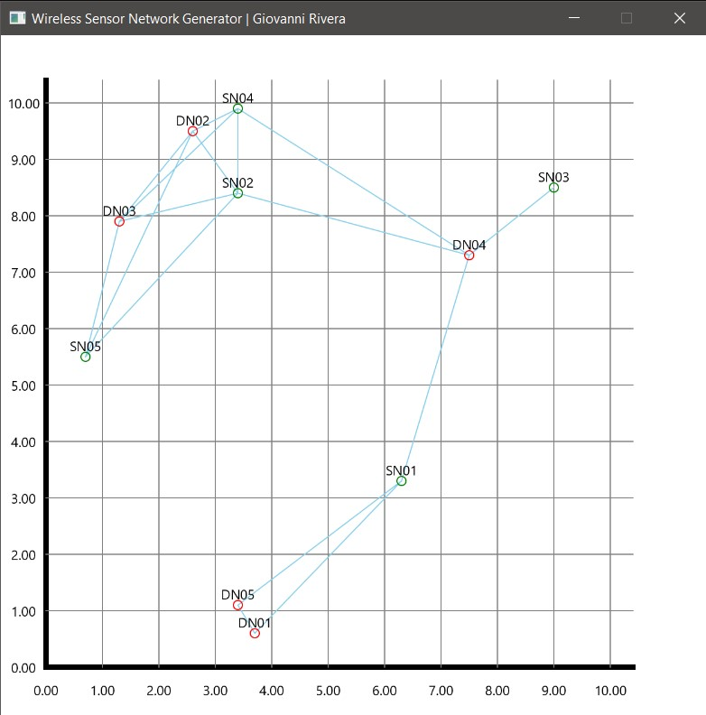
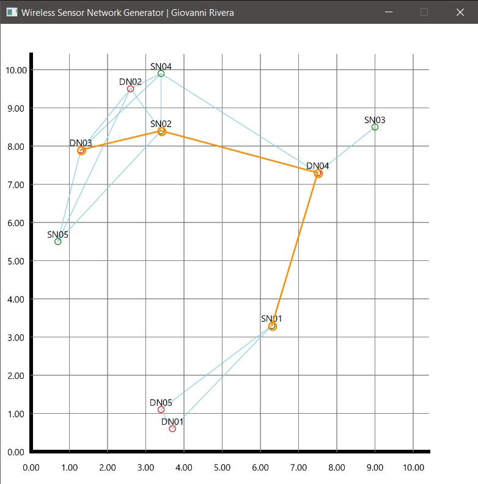

# Sensor-Generator-with-MCF

---
Sensor Network generator and visualizer for CS2 Min-Cost Flow input.

## Table of Contents

---
- [About](#about)
- [Setup](#setup)
- [Example](#example)
  - [Terminal Output](#terminal-output)
  - [Generated Sensor Network](#generated-sensor-network)
  - [Min-cost Path from DN03 to SN01](#min-cost-path-from-dn03-to-sn01)
  - [output_sensor_flow_diagram.inp](#outputsensorflowdiagraminp)
- [Related Projects](#related-projects)
- [Author](#author)

## About

---
This program generates, loads, and visualizes a sensor network and produces its flow network in **DIMAC** format for usage in
Goldberg's and Cherkassky's CS2 program from the paper "An Efficient Implementation of a Scaling Minimum-Cost Flow
Algorithm" by A.V. Goldberg, J. Algorithms, Vol. 22 (1997), pp. 1--29.

This program can also be used to run different strategies for sending data packets, such as in [grivera64/Data-Preservation-Simulation](https://github.com/grivera64/Data-Preservation-Simulation). (View in [Related Projects](#related-projects)). It was used in the published paper, "Nash Equilibria of Data Preservation in Base Station-less Sensor Networks" by Giovanni Rivera, Yutian Chen, and Bin Tang. You can view the paper [here](https://scholarworks.calstate.edu/concern/publications/vx021n445).

## Setup

---

### Dependencies

- JDK 14 or newer ([Latest JDK from Oracle](https://www.oracle.com/java/technologies/downloads/))
- JavaFX SDK 14.0.0.1 or newer ([Latest SDK from GluonHQ](https://openjfx.io/openjfx-docs/#introduction))

### 1. Clone the Repository

Open a command line or terminal instance and enter the following command:
```sh
git clone https://github.com/grivera64/Sensor-Generator-with-MCF.git
```

You can also download the repository as a zip file directly
from GitHub [here](https://github.com/grivera64/Sensor-Generator-with-MCF/archive/refs/heads/main.zip) and unzip it.

### 2. Change directories into the source folder.

```sh
cd Sensor-Generator-with-MCF
cd src
```

### 3. Compile using javac

Windows
```bat
javac -p "%PATH_TO_FX%;." --add-modules javafx.controls,javafx.graphics,javafx.swing *.java -d ../bin
```

Mac/Linux
```sh
javac -p "${PATH_TO_FX};." --add-modules javafx.controls,javafx.graphics,javafx.swing *.java -d ../bin
```

> **Note**: Environment variable `PATH_TO_FX` should be set to the location of the `lib/` folder from your JavaFX install. i.e. `openjfx-15.0.0.1-sdk/lib/`
>
> If you don't have your environment variable set up, you can replace the variable with the respective path manually.

### 4. Change directories into the binaries folder

```sh
cd ..
cd bin
```

### 5. Run the program
Windows
```sh
java -p "%PATH_TO_FX%;." --add-modules javafx.controls,javafx.graphics,javafx.swing SensorToFlowNetworkMain 
```

Mac/Linux
```sh
java -p "${PATH_TO_FX};." --add-modules javafx.controls,javafx.graphics,javafx.swing SensorToFlowNetworkMain 
```

## Example

---
### Terminal output

```txt
Please enter an option (F)ile/(G)enerate/(Q)uit:
(Q) > G
Please enter the width (x) of the sensor network:
x = 10
Please enter the height (y) of the sensor network:
y = 10
Please enter the number of sensor nodes (N) to generate in the sensor network:
N = 10
Please enter the number the transmission range (Tr) in meters:
Tr = 5
Please enter the number of Data Nodes (p) to generate:
p = 5
Please enter the number of data packets (q) each Data Node has:
q = 2
Please enter the amount of packets (m) each Storage Node has:
m = 2

Saved sensor network in file "sensor_network.sn"!
Generator Nodes   Coordinates
=================================
DN01          (3.700000, 0.600000) [3]
DN02          (2.600000, 9.500000) [5]
DN03          (1.300000, 7.900000) [8]
DN04          (7.500000, 7.300000) [9]
DN05          (3.400000, 1.100000) [10]

Storage Nodes    Coordinates
=================================
SN01          (6.300000, 3.300000) [1]
SN02          (3.400000, 8.400000) [2]
SN03          (9.000000, 8.500000) [4]
SN04          (3.400000, 9.900000) [6]
SN05          (0.700000, 5.500000) [7]

Network is connected: true
Network is feasible: true
Saved flow network in file "output_sensor_flow_diagram.inp"!
Saved sensor network in file "sensor_network.png"
```

### Generated Sensor Network



### Min-Cost path from DN03 to SN01

```txt
Please enter the Data node to traverse from (Q to quit/C to clear):
> DN03
Selected: DN03          (1.300000, 7.900000) [8]
Please enter the Sensor node to traverse to (Q to quit):
> SN01
Selected: SN01          (6.300000, 3.300000) [1]
Highlighted Min-Cost Path: [DN03, SN02, DN04, SN01]
```



### output_sensor_flow_diagram.inp

```txt
c Min-Cost flow problem with 12 nodes and 50 arcs (edges)
p min 12 50

c Supply of 10 at node 0 ("Source")
n 0 10

c Demand of -10 at node 11 ("Sink")
n 11 -10

c arc list follows
c arc has <tail> <head> <capacity l.b.> <capacity u.b> <cost>
a 0 3 0 2 0
a 0 5 0 2 0
a 0 8 0 2 0
a 0 9 0 2 0
a 0 10 0 2 0
a 3 1 0 2 644
a 3 2 0 2 1936
a 3 4 0 2 1931
a 3 6 0 2 1938
a 3 7 0 2 2581
a 5 1 0 2 1933
a 5 2 0 2 641
a 5 4 0 2 1928
a 5 6 0 2 640
a 5 7 0 2 646
a 8 1 0 2 1933
a 8 2 0 2 641
a 8 4 0 2 1928
a 8 6 0 2 643
a 8 7 0 2 642
a 9 1 0 2 646
a 9 2 0 2 646
a 9 4 0 2 641
a 9 6 0 2 648
a 9 7 0 2 1291
a 10 1 0 2 644
a 10 2 0 2 1936
a 10 4 0 2 1931
a 10 6 0 2 1938
a 10 7 0 2 2581
a 1 11 0 2 0
a 2 11 0 2 0
a 4 11 0 2 0
a 6 11 0 2 0
a 7 11 0 2 0

```

## Related Projects

---
- Data Preservation Simulation ([grivera64/Data-Preservation-Simulation](https://github.com/grivera64/Data-Preservation-Simulation))
  - A simulation for testing data preservation of base station-less networks (BSNs).
  - By Giovanni Rivera ([@grivera64](https://github.com/grivera64)) 
  
- Sensor Generator with Max Profit ([grivera64/Sensor-Generator-with-Max-Profit](https://github.com/grivera64/Sensor-Generator-with-Max-Profit))
  - Reimplementation of [grivera64/SensorGenerator-with-MCF](https://github.com/grivera64/Sensor-Generator-with-MCF) for maximizing profit in data preservation.
  - By Giovanni Rivera ([@grivera64](https://github.com/grivera64))
 
- Max Profit Data Preservation Simulation ([grivera64/Max-Profit-Data-Preservation-Simulation](https://github.com/grivera64/Max-Profit-Data-Preservation-Simulation))
  - Reimplementation of [grivera64/Data-Preservation-Simulation](https://github.com/grivera64/Data-Preservation-Simulation) for maximizing profit in data preservation.
  - By Giovanni Rivera ([@grivera64](https://github.com/grivera64)) & Christopher Gonzalez ([@chrisagonza97](https://github.com/chrisagonza97))

## Author

---
Giovanni Rivera ([@grivera64](https://github.com/grivera64))
